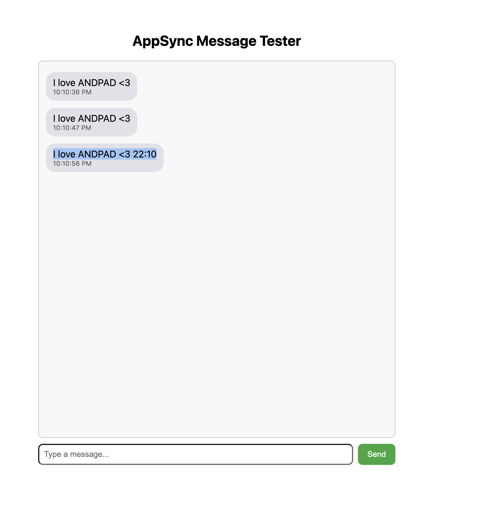

# AppSync Realtime Messages Test Application

This is a reference implementation for **subscribing** to AWS AppSync realtime messages with Lambda authorization.



## Overview

This application:

- **Subscriptions only**: Listens for messages delivered via GraphQL subscriptions. Messages are published by a backend **Subscriber** service (not by this UI).
- **Two modes** with separate AppSync endpoints and auth:
  - **Owner**: Subscribe by `shareID` and optional `constructionID`. Auth: Bearer token.
  - **Client-owner**: Subscribe by `tenantID`, `propertyID`, `orderID`. Auth: Cookie.
- **Lambda authorization**: Custom Lambda authorizer for both HTTP and WebSocket; owner uses Bearer token, client-owner uses Cookie.

## Architecture

```
┌─────────────┐         ┌─────────────┐
│   Client    │◀────────│   AppSync   │
│  (React)    │  sub    │   GraphQL   │
└─────────────┘         └─────────────┘
       │                        │
       │                 Lambda Authorizer
       │                        │
       │                 ┌──────▼──────┐
       │                 │   Lambda    │
       │                 │ Authorizer  │
       │                 └─────────────┘
       │
       │  Messages published by backend Subscriber
       │  (API → Subscriber → AppSync → this client)
       ▼
  Message log (Subscriber messages highlighted)
```

## Setup

### 1. Environment Variables

Create a `.env` file (see `.env.example`):

```bash
REACT_APP_ENV=dev
REACT_APP_AWS_REGION=ap-northeast-1
REACT_APP_OWNER_APPSYNC_ENDPOINT=https://your-owner-api-id.appsync-api.ap-northeast-1.amazonaws.com/graphql
REACT_APP_CLIENT_OWNER_APPSYNC_ENDPOINT=https://your-client-owner-api-id.appsync-api.ap-northeast-1.amazonaws.com/graphql
REACT_APP_AUTH_TOKEN=your-bearer-token-for-owner-mode
```

For **client-owner** mode you can optionally set:

```bash
# Optional: cookie string for client-owner. If unset, the app uses document.cookie in the browser.
# When exporting from shell, use single quotes so $ in the cookie is not expanded:
#   export REACT_APP_AUTH_COOKIE='name=value; __Secure-SID=...'
REACT_APP_AUTH_COOKIE=
```

### 2. Install and Run

```bash
npm install
npm start
```

The app runs at `http://localhost:3000`.

## Usage

### Owner Mode

1. Select **Owner Mode**.
2. Enter **shareId** and **constructionID** (optional). The UI shows: “Listening for messages published by the Subscriber on shareId / constructionID: …”.
3. Subscribe; messages published by the backend Subscriber for that share/construction will appear in the log. Messages from the Subscriber are highlighted (yellow).

### Client-Owner Mode

1. Select **Client-Owner Mode**.
2. Enter **tenantID**, **propertyID**, and **orderID**. The UI shows: “Listening for messages published by the Subscriber on tenantID / propertyID / orderID: …”.
3. Subscribe; messages for that tenant/property/order will appear. Subscriber messages are highlighted.

### UI Details

- **Environment** and **AppSync endpoint** are shown at the top. The endpoint is the one used for the current mode and can be copied (input + Copy button).
- **Parameters** are shown with labels, one per line. Owner mode shows shareId and constructionID only; client-owner shows tenantID, propertyID, orderID.
- **Message log**: Messages from the backend Subscriber are visually distinct (e.g. yellow background and “SENT BY Subscriber Service (Backend)”).

## Authorization

| Mode         | Auth type   | Source                                                                 |
|-------------|-------------|------------------------------------------------------------------------|
| Owner       | Bearer      | `REACT_APP_AUTH_TOKEN` (sent as `Bearer <token>`)                       |
| Client-owner| Cookie      | `REACT_APP_AUTH_COOKIE` if set, otherwise `document.cookie` in browser |

The Lambda authorizer receives the same value in `authorizationToken` for both HTTP and WebSocket (subscriptions).

## Subscription API (reference)

- **Owner**: `onMessage(shareID: String!, constructionID: String)`  
  Returns: `id`, `eventSource`, `shareID`, `constructionID`.

- **Client-owner**: `onMessage(tenantID: Int!, propertyID: Int!, orderID: Int!)`  
  Returns: `id`, `eventSource`, `tenantID`, `propertyID`, `orderID`.

Messages are published by your backend Subscriber; this app only subscribes and displays them.

## Troubleshooting

### Connection / subscription issues

- Confirm the correct **AppSync endpoint** for the selected mode (see copyable endpoint on the page).
- Ensure the Lambda authorizer accepts your token (owner: Bearer) or cookie (client-owner).
- Check the browser console for subscription or auth errors.
- If using cookie from the shell, set `REACT_APP_AUTH_COOKIE` with **single quotes** so `$` in the cookie is not expanded.

### No messages

- Verify the backend Subscriber is publishing to the same shareID/constructionID (owner) or tenantID/propertyID/orderID (client-owner).
- Ensure the subscription is active (no errors in console) before the Subscriber sends.

### Authorization errors

- **Owner**: Check `REACT_APP_AUTH_TOKEN` and that the authorizer expects a Bearer token.
- **Client-owner**: Check `REACT_APP_AUTH_COOKIE` or that the browser has the expected cookies; ensure the authorizer validates the cookie.

## References

- [AWS AppSync](https://docs.aws.amazon.com/appsync/)
- [AWS Amplify GraphQL API](https://docs.amplify.aws/react/build-a-backend/graphql-api/)
- [GraphQL Subscriptions](https://graphql.org/learn/queries/#subscriptions)
